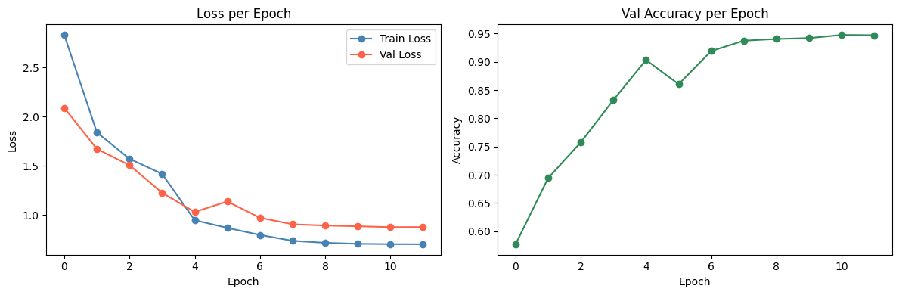
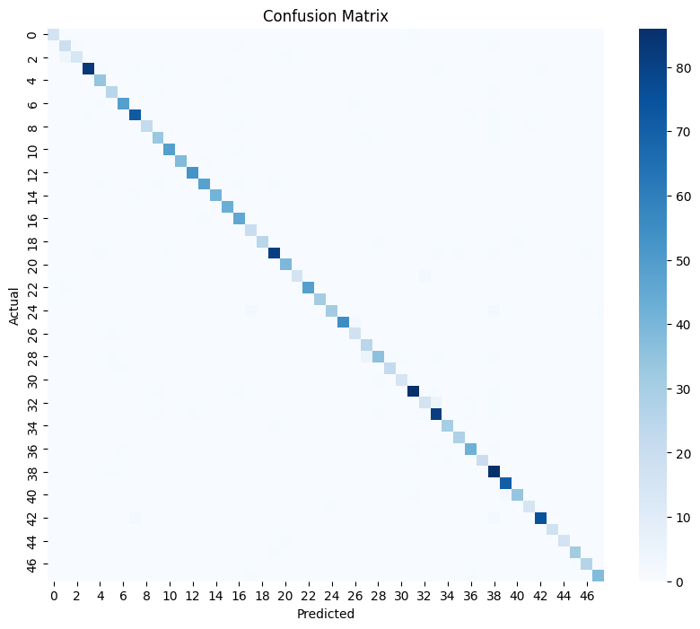
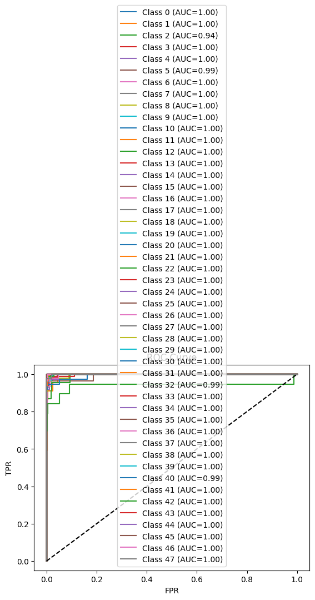
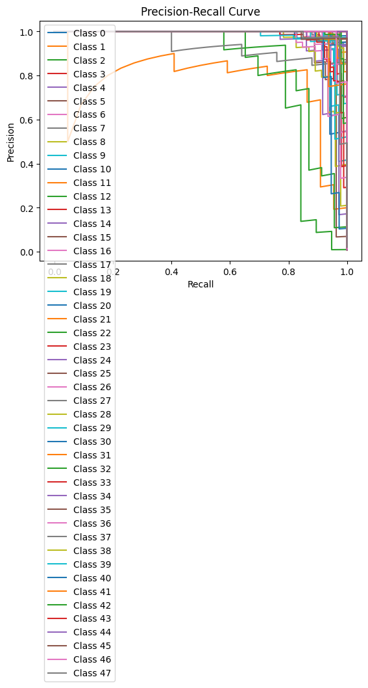
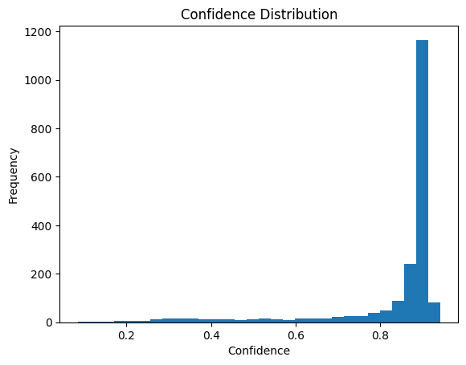

# 🐍 Indian Snake Species Classification — DINOv2 ViT-L/14

[](https://python.org)
[](https://pytorch.org)
[](https://github.com/huggingface/pytorch-image-models)
[](https://www.imageclef.org/node/288)
[](https://www.kaggle.com/)
[](LICENSE)

Fine-tuning **DINOv2 ViT-Large/14** to classify **48 Indian snake species** from the SnakeCLEF 2022 dataset using a two-phase freeze-then-unfreeze training strategy with mixed precision and checkpoint resumption.

---

## 📋 Table of Contents
- [Overview](#overview)
- [Architecture](#architecture)
- [Dataset & Filtering](#dataset--filtering)
- [Training Strategy](#training-strategy)
- [Results & Visualizations](#results--visualizations)
- [How to Run](#how-to-run)
- [Tech Stack](#tech-stack)
- [Project Structure](#project-structure)

---

## Overview

Automated snake species identification has real-world importance for biodiversity research and snakebite treatment. This project fine-tunes a **DINOv2 ViT-Large/14** backbone (loaded via `timm`) on a curated subset of the SnakeCLEF 2022 dataset — filtered specifically to **Indian snake species** with sufficient training samples.

Key highlights:
- Filtered 48 well-represented Indian species from a global dataset of 1,500+ species
- Two-phase training: head-only for 3 epochs → full fine-tuning for remaining epochs
- Mixed precision (FP16) training with gradient clipping and checkpoint resumption
- Comprehensive evaluation: confusion matrix, ROC curves, precision-recall curves, confidence distribution, and class activation maps

---

## Architecture

```
Input Image (518 × 518 × 3)
         │
         ▼
┌─────────────────────────────────────────┐
│         DINOv2 ViT-Large/14             │
│      (timm: vit_large_patch14_dinov2)   │
│                                         │
│  • 24 Transformer Blocks                │
│  • Patch size: 14×14                    │
│  • Embed dim: 1024                      │
│  • Frozen for first 3 epochs            │
│    → Fully unfrozen from epoch 4        │
└─────────────────┬───────────────────────┘
                  │
                  ▼
         [CLS Token Output]
         (1024-dimensional)
                  │
                  ▼
┌─────────────────────────────────────────┐
│          timm Default Head              │
│   Linear(1024 → num_classes=48)         │
└─────────────────────────────────────────┘
                  │
                  ▼
        Class Logits (48 species)
                  │
                  ▼
     Softmax → Predicted Species
```

### Design Choices

| Component | Choice | Rationale |
|-----------|--------|-----------|
| Backbone | DINOv2 ViT-L/14 | State-of-the-art self-supervised ViT with strong visual representations |
| Input Size | 518×518 | Native resolution for DINOv2 ViT-L/14 (patch size 14, optimal tile fit) |
| Classifier Head | timm default Linear head | Lightweight; avoids overfitting on a ~10K sample dataset |
| Phase 1 (ep 1–3) | Backbone frozen, head trained only | Warm-starts the head before disturbing pre-trained features |
| Phase 2 (ep 4–12) | Full model unfrozen | Allows backbone to adapt to fine-grained snake texture features |
| Optimizer | AdamW (lr=2e-5, wd=1e-4) | Weight decay regularization, suitable for transformer fine-tuning |
| Scheduler | CosineAnnealingLR (T_max=12) | Smooth LR decay over full training run |
| Loss | CrossEntropyLoss (label_smoothing=0.1) | Prevents overconfident predictions on visually similar species |
| Precision | FP16 via `torch.amp.GradScaler` | ~2× memory efficiency, faster training on Kaggle T4 GPUs |
| Grad Clipping | `clip_grad_norm_` (max=1.0) | Stabilizes training in early unfreeze phase |

---

## Dataset & Filtering

- **Source**: [SnakeCLEF 2022](https://www.imageclef.org/node/288) — global snake image dataset
- **Metadata files used**:
  - `SnakeCLEF2022-TrainMetadata.csv` — image paths and class labels
  - `SnakeCLEF2022-ISOxSpeciesMapping.csv` — country-level species presence flags
- **Filtering pipeline**:
  1. Extracted all species where `india == 1` from the ISO mapping → native Indian species
  2. Matched against training metadata by `binomial_name`
  3. Kept only species with **100–600 images** (removes rare and overrepresented classes)
  4. Final dataset: **48 species**

- **Train/Val split**: 85/15 stratified split by `class_id` (random seed = 42)
- **Label remapping**: Original SnakeCLEF class IDs remapped to contiguous 0–47 range

### Augmentation Pipeline

| Split | Transforms Applied |
|-------|--------------------|
| Train | Resize(518,518), RandomHorizontalFlip, ColorJitter(b=0.2, c=0.2, s=0.2, h=0.1), Normalize(ImageNet) |
| Val | Resize(518,518), Normalize(ImageNet) only |

---

## Training Strategy

```
Epochs 1–3   │ Backbone FROZEN   │ Only head.parameters() trainable
─────────────┼───────────────────┼──────────────────────────────────
Epoch 4+     │ Backbone UNFROZEN │ All parameters trainable
```

- **Checkpoint saving**: Every 500 batches + end of each epoch → `/kaggle/working/checkpoint.pth`
- **Best model saving**: Saved whenever validation accuracy improves → `/kaggle/working/best_model.pth`
- **Checkpoint resumption**: Automatically resumes from saved checkpoint if one exists (epoch + batch index aware)
- **Multi-GPU**: Supports `DataParallel` if multiple GPUs are detected on Kaggle

---

## Results & Visualizations

### Metrics

| Metric | Value |
|--------|-------|
| Best Validation Accuracy | ~95% |
| Number of Classes | 48 |
| Training Epochs | 12 |
| Batch Size | 8 |

---

### 📊 Training & Validation Loss Curves




---

### 📈 Validation Accuracy per Epoch


---

### 🔲 Confusion Matrix




---

### 📉 ROC Curve (per class)




---

### 🎯 Precision–Recall Curve




---

### 📦 Confidence Score Distribution




---


### 📋 Classification Report


```
                precision    recall  f1-score   support

           0       1.00      0.94      0.97        17
           1       0.79      0.86      0.83        22
           2       0.93      0.74      0.82        19
           3       0.99      0.94      0.97        88
           4       0.89      0.97      0.93        35
           5       0.86      0.93      0.89        27
           6       0.96      0.96      0.96        51
           7       0.95      0.96      0.95        75
           8       1.00      0.88      0.94        25
           9       0.87      0.94      0.90        35
          10       0.98      0.98      0.98        50
          11       1.00      0.97      0.99        39
          12       0.98      1.00      0.99        53
          13       0.96      0.92      0.94        52
          14       1.00      0.98      0.99        42
          15       0.98      1.00      0.99        43
          16       0.90      0.98      0.94        47
          17       0.87      1.00      0.93        20
          18       1.00      0.93      0.96        27
          19       0.96      0.93      0.95        87
          20       0.95      1.00      0.97        39
          21       1.00      0.89      0.94        18
          22       1.00      0.98      0.99        50
          23       1.00      1.00      1.00        31
          24       0.97      0.86      0.91        36
          25       1.00      0.96      0.98        57
          26       0.85      0.94      0.89        18
          27       0.81      1.00      0.89        25
          28       0.92      0.78      0.85        46
          29       0.96      0.92      0.94        24
          30       0.94      0.94      0.94        16
          31       0.97      0.96      0.96        90
          32       0.84      0.70      0.76        23
          33       0.89      0.93      0.91        87
          34       0.97      0.97      0.97        31
          35       0.97      1.00      0.98        28
          36       0.91      0.91      0.91        46
          37       1.00      0.95      0.98        21
          38       0.85      0.99      0.91        87
          39       0.97      1.00      0.99        71
          40       0.97      0.92      0.94        37
          41       0.94      0.94      0.94        16
          42       0.99      0.95      0.97        79
          43       1.00      1.00      1.00        17
          44       1.00      0.94      0.97        17
          45       0.97      0.97      0.97        32
          46       0.96      0.96      0.96        27
          47       0.97      0.95      0.96        40

    accuracy                           0.95      1963
   macro avg       0.95      0.94      0.94      1963
weighted avg       0.95      0.95      0.95      1963
```

---

## How to Run

### On Kaggle (Recommended)
1. Open the notebook: *[your Kaggle notebook link here]*
2. Add the SnakeCLEF 2022 dataset: **Data → Add Data → Competitions → SnakeCLEF2022**
3. Enable GPU: **Settings → Accelerator → GPU T4 x2**
4. Run all cells — checkpoint resumption is automatic if the session is interrupted

### Locally
```bash
git clone https://github.com/raunakprajapatii/snake-species-classifier
cd snake-species-classifier
pip install torch torchvision timm scikit-learn matplotlib seaborn pandas pillow
jupyter notebook SnakeSpeciesClassifier.ipynb
```

Update these paths in the notebook before running:
```python
BASE_PATH      = "/path/to/snakeclef2022"
TRAIN_METADATA = BASE_PATH + "/SnakeCLEF2022-TrainMetadata.csv"
TRAIN_IMG_DIR  = BASE_PATH + "/SnakeCLEF2022-medium_size/SnakeCLEF2022-medium_size"
```

---

## Tech Stack

| Library | Purpose |
|---------|---------|
| `PyTorch` | Model training, loss, optimizer, mixed precision (AMP) |
| `timm` | DINOv2 ViT-L/14 model loading and pretrained weights |
| `torchvision` | Image transforms and augmentation pipeline |
| `scikit-learn` | Stratified split, classification report, confusion matrix, ROC/PR curves |
| `Matplotlib / Seaborn` | All training and evaluation visualizations |
| `Pandas / NumPy` | Metadata loading, filtering, and array ops |
| `Pillow` | Image loading with truncation tolerance |

---

## Project Structure

```
snake-species-classifier/
│
├── SnakeSpeciesClassifier.ipynb  
├── README.md                     
└── assets/                      
    ├── loss_curve.png
    ├── val_accuracy.png
    ├── confusion_matrix.png
    ├── roc_curve.png
    ├── precision_recall.png
    ├── confidence_distribution.png
   
```

---

## Author

**Rounak** — [GitHub](https://github.com/raunakprajapatii) · [LinkedIn](http://www.linkedin.com/in/rounak-prajapati-3896jee)

*Built as an academic group course project on deep learning and computer vision*

---

## License

This project is licensed under the [MIT License](LICENSE).
